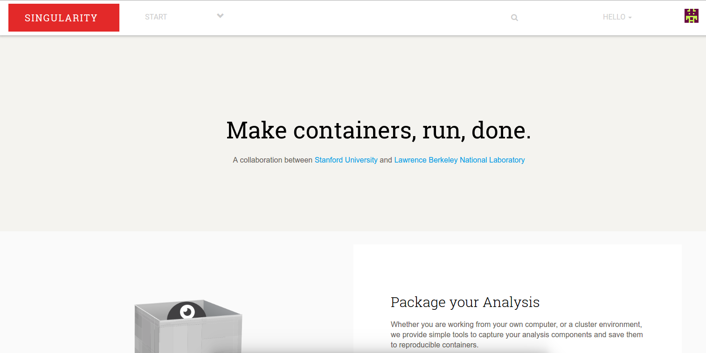

# Singularity Hub

**under development**

General Thinking:

### Modeling

##### Workflows:

 - common workflow language

##### Images 
 - singularity
 - to start users will upload containers as files, eventually we should have pushing from command line
 - is there the equivalent of a Dockerfile for a container? If so, would be more cost effective to store these, but then downloading / using a workflow would require downloading then building.
 - model of an image can have version control [eg1](https://pypi.python.org/pypi/django-versioning),[eg2](https://django-reversion.readthedocs.io/en/stable/)

### Integrations
 - open science framework
 - Github? Continuous integration? (might discuss these later)

### Views

- in the same way a user can select an image to run a portion of an analysis, we should provide some basic, standard template views (eg, something to display a graph, csv file, etc) that a user can add to a workflow, and upload results to it. This is important because when the entire workflow is submit for a publication, the user can point to the workflow on singularity hub and it's all there.

### Use Cases

##### Running Analysis Workflow

- User creates singularity images with or without tools on local machine or cluster
- Uploads to singularity hub
- Creates a workflow [interactively](http://www.jointjs.com/demos/devs), and selects images. Workflow has a unique id
- Downloads some (SLURM/SGE, etc) tool
- on his cluster, gives workflow unique id to the tool, and workflow jobs are run

##### Analysis Reproducibility

- User creates and runs workflow as detailed above, produces result
- Uploads or links result to workflow
- Submits with paper, or links to using open science framework.

##### Social Network Integration

- I should be able to comment on an image or workflow (disqus would be easy)
- I should be able to embed / export a workflow to my blog
- I should be able to share on social media (facebook and twitter)

### Questions
- Privacy: researchers are always going to be cautious of scooping, etc., and would want to be able to upload images that are private. We might want to allow for this, but add extra features for public workflows, and encourage users to make their images public.
- Provenance: we might be able to keep track of the number of times a workflow is downloaded, but tracking provenance / results of a workflow is challenging, because the user is pointing at the tool. Eventually we might want some way for users to run a workflow and link to a results object.

### Additional Work Needed
- ability to capture a workflow from a node / local computer --> singularity container
- easy programmatic access to meta data about an image (eg, I should be able to understand acceptable inputs and outputs from the header)
- standard "result" templates to put at the end of workflows
- cluster / environment specific command line tools for working with workflow data structures
